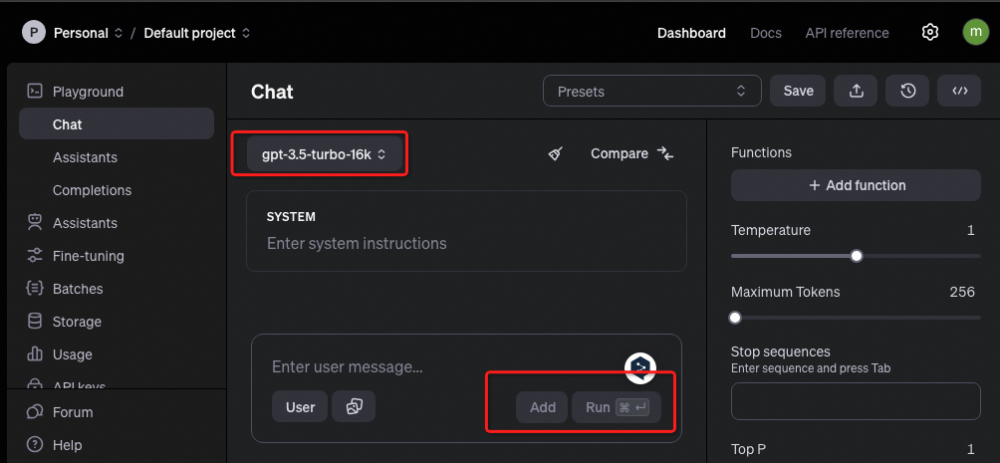

# 帐号注册
[访问https://platform.openai.com/注册帐号](https://platform.openai.com/)
可以用google帐号注册   
注册完成后需要进行手机号码验证，很遗憾，国内手机号码无法验证，参考[这篇文章](https://blog.dingtone.me/zh/receive-sms-sites/)，使用sms-activate.org付费购买了一个马来西亚的号码顺利验证通过  
**注意1:国家选择最好根自己选择的vpn节点相同，可以尽可能避免被封**
**注意2:购买号码后有效使用时间只有4分钟，记得操作要麻利点**

注册帐号成功后就能在[playground](https://platform.openai.com/playground/chat?models=gpt-3.5-turbo-16k)使用聊天服务，免费帐户服务使用次数是有限的

# 设置API keys
可以通过api接口调用openai的服务，这种方式需要设置API key。  
[点此设置API keys](https://platform.openai.com/api-keys)
按提示设置完成后将Secret key保存到本地

# 购买套餐
[这里点击Add Payment details购买套餐](https://platform.openai.com/settings/organization/billing/overview)