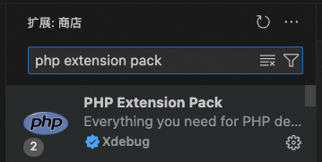

# Homebrew
## 安装Homebrew
/bin/bash -c "$(curl -fsSL https://raw.githubusercontent.com/Homebrew/install/HEAD/install.sh)"
## 更新Homebrew
brew update.  

# PHP
## 安装PHP
brew install php  
## 检查版本
php -v
## 查看位置
where php
## 查找php.ini位置
php --ini

# Composer
## 安装Composer
brew install composer
## 检查是否安装成功
composer -V
## 更新版本
composer update
## 常见Composer 命令
```
安装项目依赖：  
composer install
添加新的依赖：
composer require vendor/package
更新依赖：
composer update
移除依赖：
composer remove vendor/package
修改库镜像
composer config -g repo.packagist composer https://mirrors.aliyun.com/composer/
恢复默认镜像
composer config -g repos.packagist composer https://repo.packagist.org
```

# MySql
# 安装MySql
brew install mysql
## 启动/关闭MySql
```
brew services start mysql
brew services stop mysql
或
mysql.server start
mysql.server stop
```
## 安全配置 MySQL
mysql_secure_installation


# 安装Node及NPM
brew install node

# 新建Laravel项目
- [查看教程](https://learnku.com/docs/laravel/10.x/installation/14835#d05bfc)
```
composer create-project laravel/laravel example-app
或者，你可以通过 Laravel 安装器作为全局 Composer 依赖：
composer global require laravel/installer
laravel new example-app
```
## 启动本地服务
cd example-app  

php artisan serve  

## 查看程序配置
php artisan about
## 查看详细数据库配置
php artisan config:show database
## 查看artisan命令帮助
php artisan list make

# 配置XDebug调试
## 安装Xdebug
pecl install xdebug   
安装完成后会有一个地址，一般是/usr/local/Cellar/php/8.3.8/pecl/20230831/xdebug.so
## 配置Xdebug
找到系统 php.ini(用`php --ini`命令找到位置) 文件并添加如下配置,注意端口号与host不要配置错误   
```
[Xdebug]
zend_extension = xdebug.so 
xdebug.mode=debug
xdebug.start_with_request=yes
xdebug.client_host=127.0.0.1
xdebug.client_port=8000  
xdebug.log=/tmp/xdebug.log 
```
## 配置Xdebug扩展

该扩展包含了xdebug及代码智能提示两个扩展
## 配置launch.json
在侧栏点击“调试（Debug）”图标或者按 Ctrl+Shift+D   
点击上方的“创建 launch.json 文件”按钮，并选择“PHP”
## 验证配置
`php artisan serve`重启服务   
php代码中加断点
vscode中点击调试按钮（Listen for Xdebug）

**如果断点不生效可以查一下xdebug的log**，`vi /tmp/xdebug.log`

# 安装数据库管理软件MySQL Workbench(用不太习惯，不过里面可以生成图形化表还不错)
[进入页面，不要登录，直接下载](https://downloads.mysql.com/archives/workbench/)

# 安装数据库管理软件Sequel Ace
[可以appstore下载，页可以github下载最新版本](https://github.com/Sequel-Ace/Sequel-Ace)


