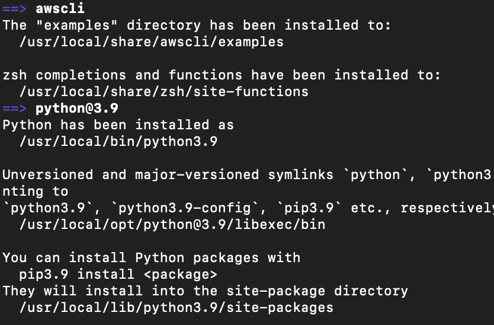
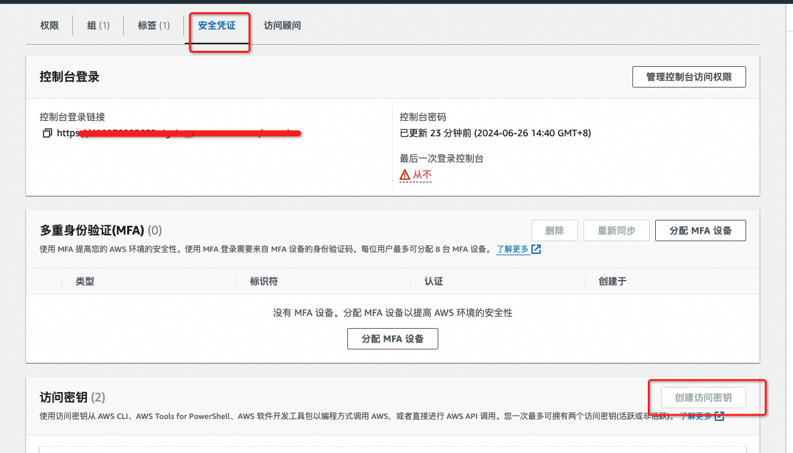
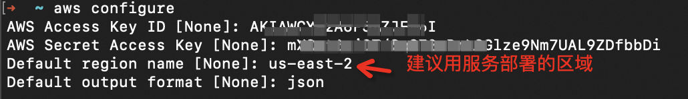
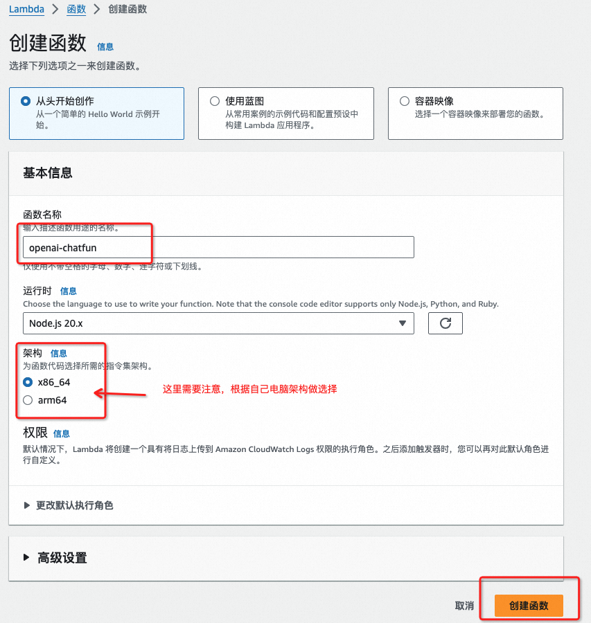
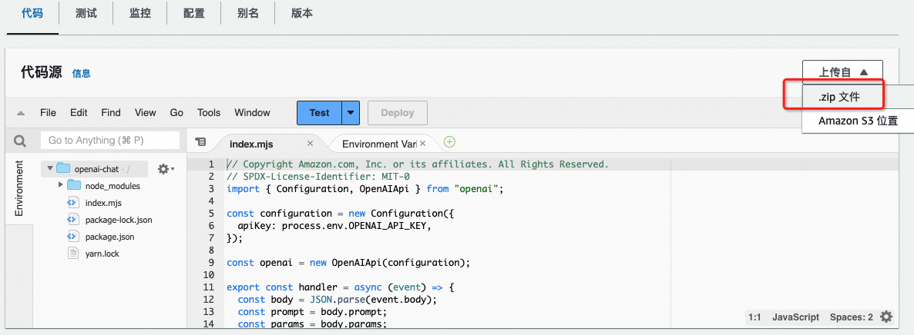
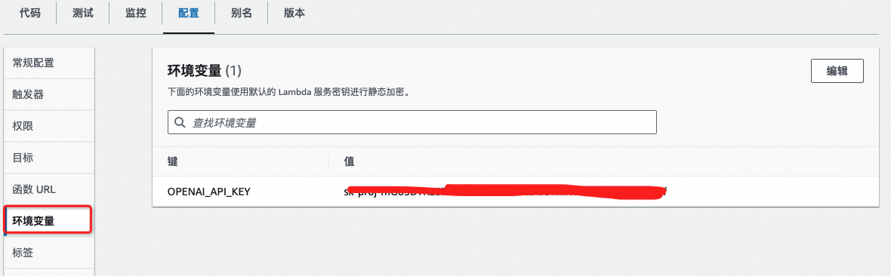
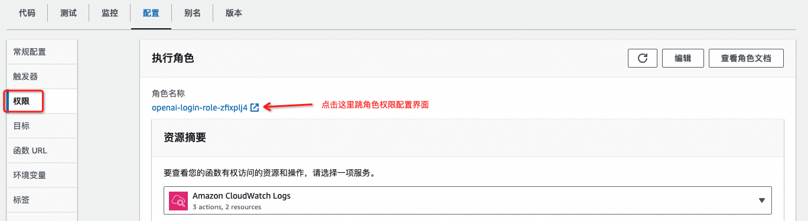

**亚马逊原版教程：**
[教程](https://aws.amazon.com/cn/campaigns/build-your-own-chatgpt/)

# 注册OpenAI帐号并开通Api接口服务
[见OpenAI服务使用](OpenAI服务使用/OpenAI服务使用.md)

# 注册亚马逊帐号
[访问https://aws.amazon.com注册帐号](https://aws.amazon.com/)
注册帐号需要进行电话号码及信用卡验证

# 安装亚马逊命令行工具awscli
awscli是一个本地管理亚马逊服务的cli工具  
Mac上使用`brew install awscli`进行安装，windows上请自行gpt  
可能会出现Error: python@3.11报错  
按提示执行`xcode-select --install`   
正常安装成功后如下所示：  

## 配置 AWS CLI
创建IAM管理帐户，通过给该帐号分配权限来管理AWS资源
[可以在根用户创建访问密钥，但是不推荐](https://us-east-1.console.aws.amazon.com/iam/home?region=us-east-1#/security_credentials)
[推荐创建IAM用户及访问密钥](https://us-east-1.console.aws.amazon.com/iam/home?region=us-east-1#/users/details/bluemap?section=security_credentials)

在权限选择时需要勾选带aws cli的选项
**重要：**创建完成后下载.csv文件保存下来,一定要下载下来或者将key id及access key复制下来保存，我在平台上没有找到二次查看access key的方法。
[详细配置见官方文档](https://docs.aws.amazon.com/zh_cn/cli/latest/userguide/getting-started-prereqs.html)
接下来用下面的命令配置aws
```
aws configure
如果提示没有权限则使用：
sudo aws configure 
```

配置完成后[为默认用户设置环境变量](https://docs.aws.amazon.com/zh_cn/cli/latest/userguide/cli-configure-envvars.html)
```
export AWS_ACCESS_KEY_ID=AKIAWCYW2A6F5******按实际替换
export AWS_SECRET_ACCESS_KEY=mXOpt6sjO******按实际替换
export AWS_DEFAULT_REGION=us-west-2 按实际替换
```
[详细配置及使用方案看官方文档](https://docs.aws.amazon.com/zh_cn/cli/latest/userguide/cli-configure-files.html)

# 安装node.js
```
brew update
brew install node
node -v
```
# 拉取亚马逊demo代码
```
git clone https://github.com/aws-samples/aws-serverless-openai-chatbot-demo.git
```
可以将整个文件拖到VSCode里，方便编辑与查看，目录结构如下：
  

lambda_authorization、lambda_chat、lambda_login文件夹里的内容需要分别进行编译并打包成zip，作为亚马逊lambada函数的执行代码  
```
cd server/lambda_login
npm install
zip -r lambda_login.zip .
**注意:zip命令末尾有一个点**

cd ../
cd ./lambda_chat
npm install
zip -r lambda_chat.zip .

cd ../
cd ./lambda_authorization
npm install
zip -r lambda_auth.zip .
```

# 创建Lambda函数
[进这里创建函数](https://us-west-2.console.aws.amazon.com/lambda/home?region=us-west-2#/functions)
**注意看页面右上角的区域，函数是绑定在区域下的，这里要用到的服务都需要在同一区域之下**
## 创建一个 Lambda 函数来处理聊天会话
创建名为openai-chat的函数（名称随自己喜欢）

切换到“代码”tab，点击上传，选择.zip上传，将lambda_chat.zip文件上传上去

切换到“配置”添加环境变量OPENAI_API_KEY，并设置为openai中的key值

切换到“常规配置”修改超时为2分钟
## 创建一个 Lambda 函数，用于 AWS API Gateway 请求鉴权
在亚马逊云科技 Lambda 控制台中，从头开始创建一个名为 chat-authorizer 的 Lambda 函数，选择 Node.js 作为运行时。  
在环境变量中配置一个名为“TOKEN_KEY”的环境变量，自定义一个值，该值将作为 JWT(Json Web Token) 签名密钥。  
将之前创建的 lambda_auth.zip 文件上传到 Lambda 代码源（与创建 open-chat 步骤相同）。  
## 创建一个 Lambda 函数来处理用户登录请求
在亚马逊云科技 Lambda 控制台中，从头开始创建一个名为 openai-login 的 lambda 函数，选择 Node.js 作为运行时。  
添加 TOKEN_KEY  环境变量(与 chat-authorizer 相同)：  
此函数将调用 DynamoDB 的 API 来验证用户名和密码，因此我们需要附加 Amazon DynamoDBReadOnlyAccess 策略或为此函数的执行角色创建访问 DynamoDB 的内联策略。
切换到“权限”，点击角色名称，跳转角色权限配置界面，输入Amazon DynamoDBReadOnlyAccess搜索并勾选权限  



# 创建 API Gateway
创建一个名为“chatbot”的 HTTP API

# 查看相关日志
[查看相关日志](https://us-west-2.console.aws.amazon.com/cloudwatch/home?region=us-west-2#home:)

