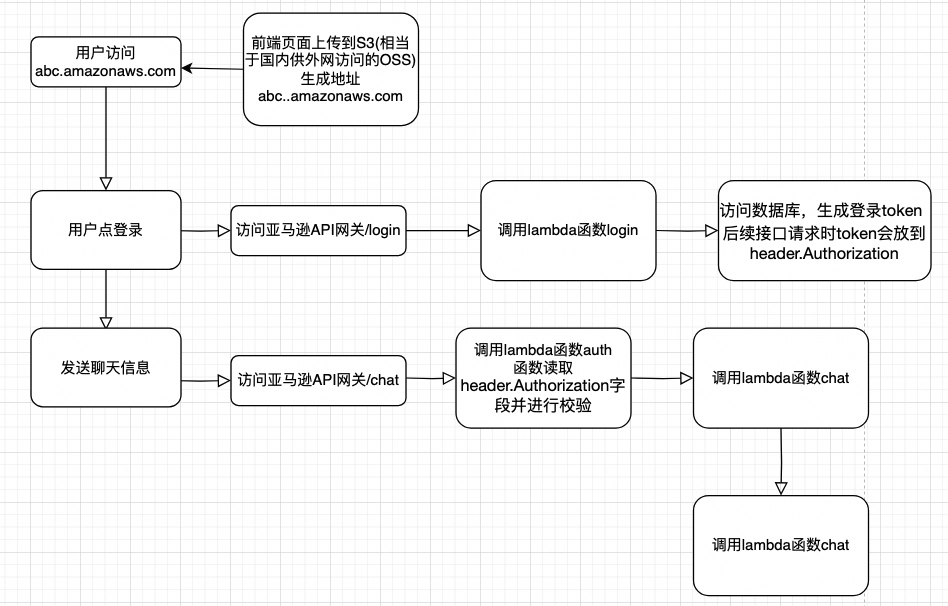

**亚马逊原版教程：**
[教程](https://aws.amazon.com/cn/campaigns/build-your-own-chatgpt/)

# 注册OpenAI帐号并开通Api接口服务
[见OpenAI服务使用](OpenAI服务使用/OpenAI服务使用.md)

# 注册亚马逊帐号
[访问https://aws.amazon.com注册帐号](https://aws.amazon.com/)
注册帐号需要进行电话号码及信用卡验证

# 安装亚马逊命令行工具awscli
awscli是一个本地管理亚马逊服务的cli工具  
Mac上使用`brew install awscli`进行安装，windows上请自行gpt  
可能会出现Error: python@3.11报错  
按提示执行`xcode-select --install`   
正常安装成功后如下所示：  

## 配置 AWS CLI
创建IAM管理帐户，通过给该帐号分配权限来管理AWS资源
[可以在根用户创建访问密钥，但是不推荐](https://us-east-1.console.aws.amazon.com/iam/home?region=us-east-1#/security_credentials)
[推荐创建IAM用户及访问密钥](https://us-east-1.console.aws.amazon.com/iam/home?region=us-east-1#/users/details/bluemap?section=security_credentials)

在权限选择时需要勾选带aws cli的选项   
**重要：创建完成后下载.csv文件保存下来,一定要下载下来或者将key id及access key复制下来保存，我在平台上没有找到二次查看access key的方法。**
[详细配置见官方文档](https://docs.aws.amazon.com/zh_cn/cli/latest/userguide/getting-started-prereqs.html)   
接下来用下面的命令配置aws   
```
aws configure   
如果提示没有权限则使用：   
sudo aws configure    
```

配置完成后[为默认用户设置环境变量](https://docs.aws.amazon.com/zh_cn/cli/latest/userguide/cli-configure-envvars.html)

```
export AWS_ACCESS_KEY_ID=AKIAWCYW2A6F5******按实际替换
export AWS_SECRET_ACCESS_KEY=mXOpt6sjO******按实际替换
export AWS_DEFAULT_REGION=us-west-2 按实际替换
```

[详细配置及使用方案看官方文档](https://docs.aws.amazon.com/zh_cn/cli/latest/userguide/cli-configure-files.html)

# 安装node.js
```
brew update
brew install node
node -v
```
# 拉取亚马逊demo代码
```
官方给的代码是这个，但是对openai访问的接口太旧了，有bug，需要使用我修改过的版本
git clone https://github.com/aws-samples/aws-serverless-openai-chatbot-demo.git
修改过的版本如下：
git clone git@github.com:bluemap/aws-serverless-openai-chatbot-demo.git
```
可以将整个文件拖到VSCode里，方便编辑与查看，目录结构如下：
  

lambda_authorization、lambda_chat、lambda_login文件夹里的内容需要分别进行编译并打包成zip，作为亚马逊lambada函数的执行代码  

```
cd server/lambda_login
npm install
zip -r lambda_login.zip .
**注意:zip命令末尾有一个点**   
```

```
cd ../
cd ./lambda_chat
npm install
zip -r lambda_chat.zip .   
```

```
cd ../
cd ./lambda_authorization
npm install
zip -r lambda_auth.zip .
```

# 创建Lambda函数
lambda函数可以理解为运行在亚马逊云上的微服务   
[进这里创建函数](https://us-west-2.console.aws.amazon.com/lambda/home?region=us-west-2#/functions)
**注意看页面右上角的区域，函数是绑定在区域下的，这里要用到的服务都需要在同一区域之下**
## 创建一个 Lambda 函数来处理聊天会话
创建名为openai-chat的函数（名称随自己喜欢）

切换到“代码”tab，点击上传，选择.zip上传，将lambda_chat.zip文件上传上去

切换到“配置”添加环境变量OPENAI_API_KEY，并设置为openai中的key值

切换到“常规配置”修改超时为2分钟，因为openai接口比较耗时
## 创建一个 Lambda 函数，用于 AWS API Gateway 请求鉴权
在亚马逊云科技 Lambda 控制台中，从头开始创建一个名为 chat-authorizer 的 Lambda 函数，选择 Node.js 作为运行时。  
在环境变量中配置一个名为“TOKEN_KEY”的环境变量，自定义一个值，该值将作为 JWT(Json Web Token) 签名密钥。  
将之前创建的 lambda_auth.zip 文件上传到 Lambda 代码源（与创建 open-chat 步骤相同）。  
## 创建一个 Lambda 函数来处理用户登录请求
在亚马逊云科技 Lambda 控制台中，从头开始创建一个名为 openai-login 的 lambda 函数，选择 Node.js 作为运行时。  
添加 TOKEN_KEY  环境变量(与 chat-authorizer 相同)：  
此函数将调用 DynamoDB 的 API 来验证用户名和密码，因此我们需要附加 Amazon DynamoDBReadOnlyAccess 策略或为此函数的执行角色创建访问 DynamoDB 的内联策略。
切换到“权限”，点击角色名称，跳转角色权限配置界面，输入Amazon DynamoDBReadOnlyAccess搜索并勾选权限  


# 创建 API Gateway
创建一个名为“chatbot”的 HTTP API   
**知识点扫盲：api网关是统一的对外服务接口，其内部对接不同的服务实现方，可以理解为其只是一个服务中介**   
### 添加chat与login路由,类型选post，分别关联之前的lambda函数openai-chat和openai-login

### 在chat路由上增加一个授权   
**因为chat路由关联的是openai-chat接口，需要访问openai的服务，需要限制未授权的用户访问**


### 配置集成，配置好后进行部署，部署时勾选自动部署，这样下次配置改变时能实时生效

### 配置跨资源共享

### 查看Api网关地址
切换到集成tab，可以看到网关的URL，拷贝下来，后面构建前端网页时需要用


# 创建 DynamoDB 表
使用 Amazon DynamoDB 存储用户名和密码凭证。为了简化演示，暂未实现注册功能和密码加密存储功能。   
登录并打开 Amazon DynamoDB 控制台，创建一个表名 `chat_user_info`,分区键名为 username，字符串类型。
增加一列password,类型选字符串型

编辑数据库表，在里面增加几组用户名和密码，后续登录时需要用   

# 部署 S3 托管网站
类似阿里云的OSS，就是想前端静态网站部署到存储服务器上，并开放公网访问
详情可参考：https://docs.aws.amazon.com/AmazonS3/latest/userguide/WebsiteHosting.html   

将存储桶配置为静态网站时，必须启用静态网站托管、配置索引文档并设置权限。   

在 Amazon S3 控制台上创建一个名为 Bucket-name(请替换成自己的存储桶名称)的 S3 存储桶。   
在“属性”选项卡中启用此存储桶的静态网站托管功能。在索引文档中，输入索引文档的文件名 index.html。  
 
默认情况下，S3 存储桶会阻止公共访问。你需要在“权限”选项卡中更改设置。

并将以下策略（请修改 bucket-name 为实际存储桶名称）添加到存储桶策略以允许能从 internet 访问。  

```
{
    "Version": "2012-10-17",
    "Statement": [
        {
            "Sid": "PublicReadGetObject",
            "Effect": "Allow",
            "Principal": "*",
            "Action": [
                "s3:GetObject"
            ],
            "Resource": [
                "arn:aws-cn:s3:::Bucket-Name/*"
            ]
        }
    ]
}
```

# 编译网站静态文件
在本地环境中，转到 client/src/commons 文件夹，将 apigw.js 的第一行更改为你创建的实际的 API gateway 端点。

在 client 目录下，然后运行这些命令来编译静态网站的文件。
 ```
 cd client
 npm install
 npm run build
 ```
 ```
 也可以通过如下命令在本地打开网页，检测功能是否正常
 npm start
 ```
 “npm run build”命令运行完成后，它将在 client 文件夹中生成一个名为“build”的文件夹。该文件夹包含了要部署到 Amazon S3 网站的所有静态文件。
  

 可以通过 S3 控制台将此文件夹上传到存储桶 AWS 或使用 AWSCLI，如下所示：   

 ```
 aws s3 sync ./build/ s3://bucket-name/
 ```   

 **注：如果嫌安装awscli麻烦也可以将build目录打包成zip，然后去s3管理控制台将网站文件上传上去**

 完成所有步骤后，现在您可以在 PC /Mobile 浏览器中访问 S3 网站，并使用你预先设置在 DynamoDB 表中的用户名和密码来登录进入。Amazon S3 静态托管网站的访问端点可以在“属性”选项卡中找到。

[访问测试页面](http://openai-web-bucket.s3-website-us-west-2.amazonaws.com/)


# 查看相关日志
可以在CloudWatch查看整体的错误日志
[查看相关日志](https://us-west-2.console.aws.amazon.com/cloudwatch/home?region=us-west-2#home:)   
也可以到具体的服务(如lambda函数)页面点击“监控”tab查看调用情况及错误日志

# 大概业务流程回顾


